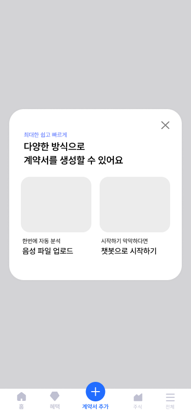
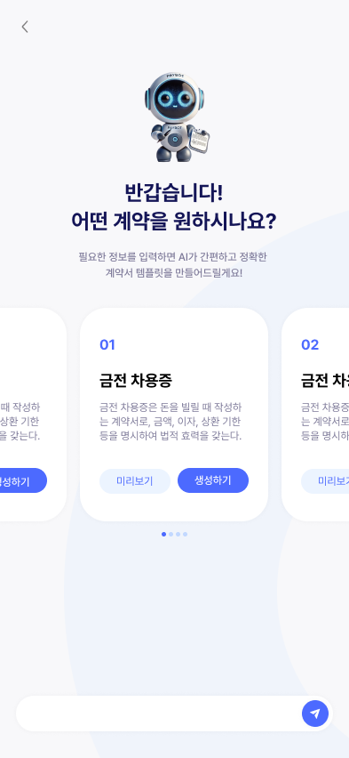

## 화면 구상

#### 0. 하단 네비게이션바

- **홈 (대시보드)
  (**진행중인 계약&주요 일정, 페이 잔액, 최근 송금 내역, 신용 온도 등)
- **계약 관리**
  (전체 계약 목록 필터별로 - 진행중/완료/연체, 계약별 상세 보기 - 계약서/송금 내역/일정/계약 상태(서명 대기, 송금 대기 등))
- **계약 생성**
  (음성 파일 업로드 or 챗봇 입력, AI 계약서 초안 자동 생성, 계약 요청 & 상대방 초대 -> 채팅방 자동 생성)
- **채팅**
  (계약별 채팅 내역, 채팅 상단 '계약서 보기'고정 버튼, 채팅바 '+'더보기 버튼 -> 송금/일정/계약 해지 등)
- **마이페이지**
  (예금/출금 내역, 나의 페이 - 송금&충전, 신용 온도, 설정)

#### 1. 마이페이지 (사용자 대시보드)

- 페이 잔액, 충전/송금 버튼
- 예금/출금 내역 (최근 3-5건, 전체 보기 버튼)
- 신용 온도 (등급 아이콘, 상세 보기?)
- 설정 (로그아웃, 정보 수정 등)
  +++ 페이에 계좌 연동 !!

#### 2. 계약 생성

- '음성 파일 업로드' / '챗봇 입력 시작' 버튼
- 파일 업로드 진행 상태 (로딩) 표시
  (업로드 > AI 분석 > 계약 초안 생성)
- 계약 상대 초대 (닉네임으로?)
- 채팅방 자동 생성
  +++ 채팅방 자동 이동할지, 이동하기 버튼 넣을지

#### 3. 계약 관리

- 전체 계약 리스트 (최근순/진행중/완료 필터)
- 각 계약별 진행 상태 배지 (서명 대기/계약 진행중/송금 완료 등)
- 클릭 시 개별 상세 정보 페이지로 이동

#### 3-2. 계약별 상세 페이지

- 계약 진행 상태 시각화 (서명 대기 > 진행중 > 송금 완료 > 계약 성사 -> 반원 그래프?)
- 계약 정보 (제목?당사자 정보?계약서 미리보기?)
- 계약 일정 (송금 일정, 계약 만료일, 주요 이벤트?)
- 송금 내역 + 잔액
- 알림
- 기타(계약서 수정 버튼, 송금 버튼, 계약 해지 요청 버튼)

#### 4. 채팅

- 상단 고정 '계약서 보기' 클릭 시 상세 계약서 확인
- 채팅 화면 (대화, 알림 메시지)
- 채팅바 좌측 '+' 더보기 버튼에서 접근 가능 기능 -> 송금, 일정, 계약 수정 요청, 해지 요청 등

