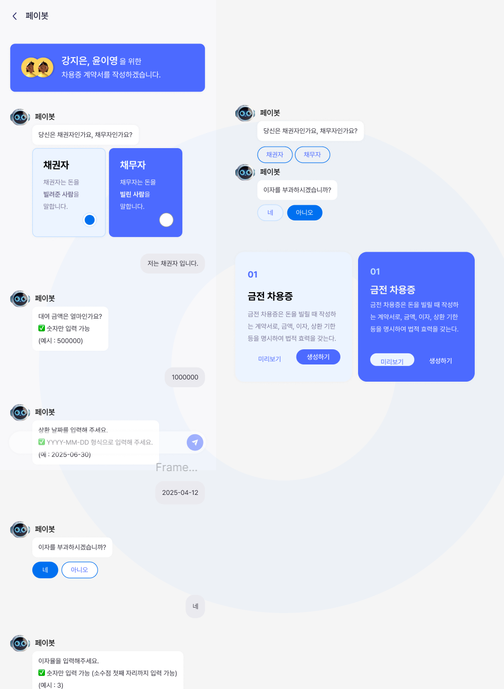

## 기획 구체화 & 목업

### **1. 연체 이자율**

> 이자제한법에 따라 최대 연체 이자율은 연 20%를 초과할 수 없음.
> 연체 이자율은 보통 기본 이자율보다 1.5배 높게 설정됨.

### 연체 이자율 설정 예시 (지인 간 거래 기준)

✔ 무이자 거래(0%) → 연체 이자율 0~3% (연체에 대한 최소한의 부담 부과)
✔ 낮은 이자율(연 3~5%) → 연체 이자율 4.5~7.5%
✔ 중간 수준 이자율(연 5~10%) → 연체 이자율 7.5~15%
✔ 높은 이자율(연 10~15%) → 연체 이자율 최대 20%

→ 고정 연체 이자율 5%으로 설정 후, 수정 가능하도록. 단, 법령에 따라 20% 초과 불가.

<br>

### **2. 챗봇 시나리오**

> 반갑습니다!
> 차용증 발급을 원하시나요?
>
> ## 필요한 정보를 선택만 해주시면 AI가 계약서를 만들어드릴게요!
>
> ---
>
> ## (시작) --> AI : 차용증 작성 날짜 입력
>
> 돈을 빌리는지, 빌려주는지 선택 --> AI : 계약서 당사자 인적 사항 입력
>
> ---
>
> 차용 금액 입력
>
> ---
>
> 상환 날짜 입력
>
> ---
>
> 이자 여부 (o/x)
>
> ---
>
> 분기 - 이자 o
> 이자율 입력
>
> 연체이자율 입력 (기본 5%를 제공하고, 수정가능하게?)
>
> ---
>
> 분기 - 이자 x
>
> 연체이자율 입력 (기본 5%를 제공하고, 수정가능하게?)
>
> ---
>
> 상환 방법을 선택
>
> 01 원리금 균등상환
>
> ```
>
> 02 원금 균등상환
> ```
>
> 03 만기일시상환
>
> ```
>
> (더보기 / 계약 생성 시작하기)
>
> ---------------------------------------------------
> ---------------------------------------------------
>  분기 - 01 원리금 균등상환
>  분기 - 02 원금 균등상환
>
> 	분할 납부 여부, 얼마씩 몇일에
> 	중도상환 여부, 얼마
>
> ---------------------------------------------------
> 특약 선택 (복수 선택 가능)
>
> 01 ~~
> 02 ~~
> 03 ~~
> 04 ~~
> ```
>
> ---
>
> 계약서 초안 제시
>
> ---
>
> 상대방 초대
>
> ---
>
> 소통 시작 (자연스럽게 챗봇 > 채팅 전환)


