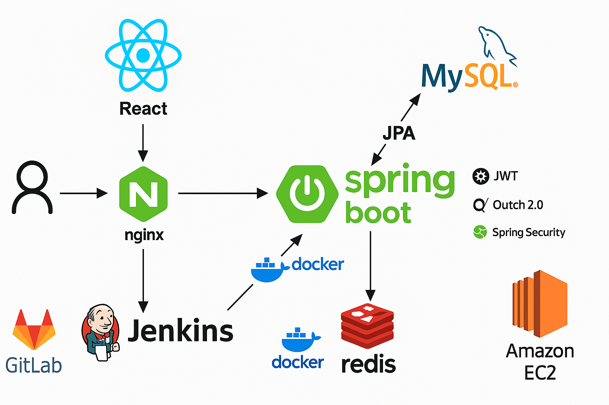

# 💼 FormMate


> **개인 간 금전 대차 계약 관리 플랫폼**

**FormMate**는 개인 간 금전 거래를 더욱 **안전하고 체계적으로** 관리할 수 있도록 지원하는 플랫폼입니다.  
챗봇 기반 계약 작성부터 전자서명, 본인 인증, 이체 연동, 상환 일정 관리, 채팅, 추심청구서 발급까지  
금전 대차 전 과정을 디지털화하여 분쟁 없는 투명한 거래를 실현합니다.

---

## 🚀 주요 기능

- 🤖 챗봇 기반 **계약서 생성** 및 **전자서명**
- 🔐 **소셜 로그인 (Google, Naver)** 및 본인 인증
- 📆 **상환 일정/납부 금액** 자동 등록 및 리마인드 알림
- 💸 **이체 기능** 연동으로 원클릭 상환
- 💬 계약 당사자 간 **채팅** 기능
- 📊 계약별 전체/세부 **상환 현황 대시보드**

---

## 👥 팀원 소개

| 이름   | 역할                | 담당     | GitHub                                               |
| ------ | ------------------- | -------- | ---------------------------------------------------- |
| 차윤영 | Developer (팀장)    | Backend  | [github.com/yuncof](https://github.com/yuncof)       |
| 이동욱 | Developer (BE 팀장) | Backend  | [github.com/2Ludy](https://github.com/2Ludy)         |
| 강지은 | Developer (FE 팀장) | Frontend | [github.com/antdundun](https://github.com/antdundun) |
| 박상학 | Developer           | Backend  | [github.com/Sang-hak](https://github.com/Sang-hak)   |
| 오은지 | Developer           | Frontend | [github.com/oeg9176](https://github.com/oeg9176)     |
| 윤이영 | Developer           | Frontend | [github.com/y20ng](https://github.com/y20ng)         |

## 🔍 시스템 아키텍처



---

## 🛠️ 기술 스택

### 💻 프론트엔드

| 분류            | 기술                                                                                                                                                                                                  | 설명                             |
| --------------- | ----------------------------------------------------------------------------------------------------------------------------------------------------------------------------------------------------- | -------------------------------- |
| 언어/프레임워크 | <br> | 타입 안정성과 컴포넌트 기반 UI   |
| 상태 관리       |                                                                                                        | 전역 상태 관리                   |
| 서버 상태       |                                                                                     | API 요청/응답 캐싱 및 상태관리   |
| 스타일링        | <br>                | 유틸리티 기반 CSS 및 UI 컴포넌트 |

---

### ⚙️ 백엔드

| 분류            | 기술                                                                                                                                                                                                                                                                                                            | 설명                           |
| --------------- | --------------------------------------------------------------------------------------------------------------------------------------------------------------------------------------------------------------------------------------------------------------------------------------------------------------- | ------------------------------ |
| 언어/프레임워크 | <br>                                                                                                        | 백엔드 REST API 및 웹소켓 처리 |
| 데이터베이스    | <br>                                                                                                                          | 메인 DB 및 세션 캐시           |
| 보안/인증       | <br><br> | 인증/인가 처리                 |

---

### ☁️ 공통 인프라 및 협업 도구

| 분류          | 기술                                                                                                                                                                                                                                                                                   | 설명                                    |
| ------------- | -------------------------------------------------------------------------------------------------------------------------------------------------------------------------------------------------------------------------------------------------------------------------------------- | --------------------------------------- |
| 메시징/알림   | <br><br>                     | 실시간 채팅, 알림, 문자 인증            |
| 배포 & 인프라 | <br><br> | EC2, RDS, S3, 리버스 프록시, 컨테이너화 |
| 협업/관리     | <br>                                                                                                           | 형상관리 및 이슈 관리                   |
| 문서화        |                                                                                                                                                                                         | API 명세 자동화                         |

---

## 🧪 실행 방법

### ✅ 사전 준비

- `.env` 또는 환경변수에 다음 정보 설정:
  - DB, Redis, JWT, OAuth, Mail, Firebase, CoolSMS 등

### ✅ 빌드 및 실행

```bash
# 빌드
./gradlew build

# 실행
java -jar build/libs/formmate-0.0.1-SNAPSHOT.jar
```

> 기본 포트: **8088**

---

## 📘 API 문서

- Swagger UI: [`http://localhost:8088/api/swagger-ui.html`](http://localhost:8088/api/swagger-ui.html)

---

## 📄 라이선스

```
본 프로젝트는 교육과정의 일환으로 개발된 비상업적 프로젝트입니다.
상업적 목적의 사용을 금지합니다.
```

© 2025 FormMate. All Rights Reserved.
